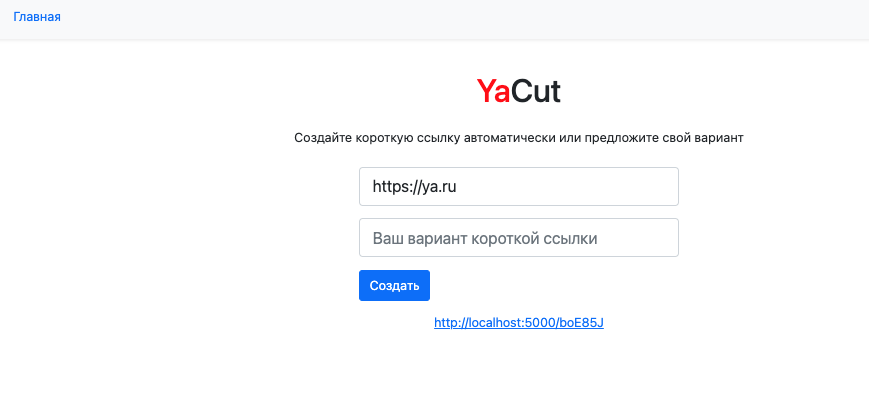

# YaCut
[](https://www.python.org/)
[](https://www.djangoproject.com/)
[](https://www.postgresql.org/)
[](https://www.django-rest-framework.org/)
[](https://www.postgresql.org/)



Сервис укорачивания ссылок с web интерфейсом и REST API. Его назначение — ассоциировать длинную пользовательскую ссылку с короткой, которую предлагает сам пользователь или предоставляет сервис.

## Ключевые возможности сервиса
- Генерация коротких ссылок и связь их с исходными длинными ссылками
- Переадресация на исходный адрес при обращении к коротким ссылкам
- /api/id/ — POST-запрос на создание новой короткой ссылки;
- /api/id/<short_id>/ — GET-запрос на получение оригинальной ссылки по указанному короткому идентификатору.

Доступны web и api интерфейсы.

## Технологии
- Python 3.10
- Flask 2.0
- Jinja2 3.0
- SQLAlchemy 1.4

## Использование
Клонировать репозиторий и перейти в него в командной строке:

```
git clone git@github.com:babichdenis/yacut.git
```

```
cd yacut
```

Cоздать и активировать виртуальное окружение:

```
python3 -m venv venv
```

* Если у вас Linux/macOS

    ```
    source venv/bin/activate
    ```

* Если у вас windows

    ```
    source venv/scripts/activate
    ```

Установить зависимости из файла requirements.txt:

```bash
python3 -m pip install --upgrade pip
```

```bash
pip install -r requirements.txt
```

Создать в корневой папке файл .env с данными:

```
FLASK_APP=yacut
FLASK_ENV=development
DATABASE_URI=sqlite:///db.sqlite3
SECRET_KEY=YOUR_SECRET_KEY
```

Создать базу данных и выполнить миграции:

```commandline
flask db upgrade
```

Запуск проекта:

```commandline
flask run
```
Приложение будет доступно по адресу: http://127.0.0.1:5000/


---

Автор проекта: <a href="https://github.com/babichdenis">babichdenis</a>
</h5>
